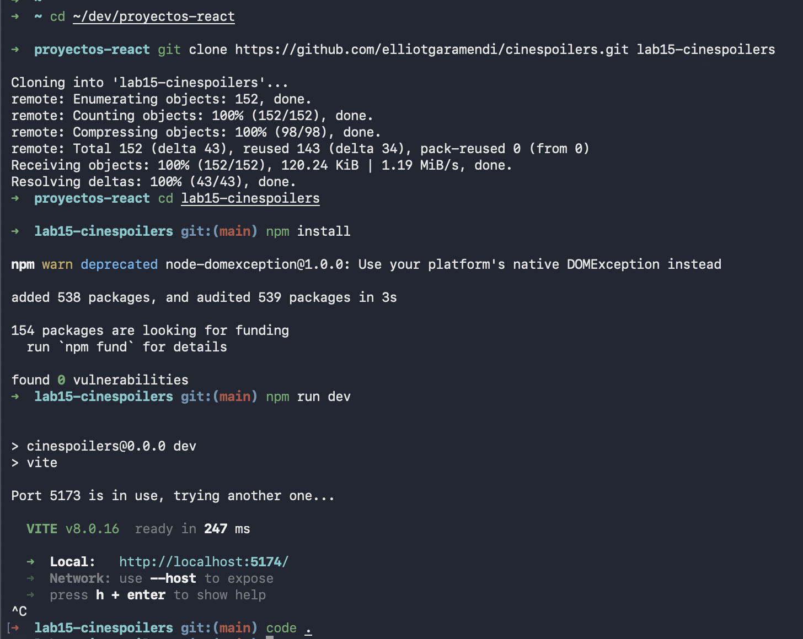
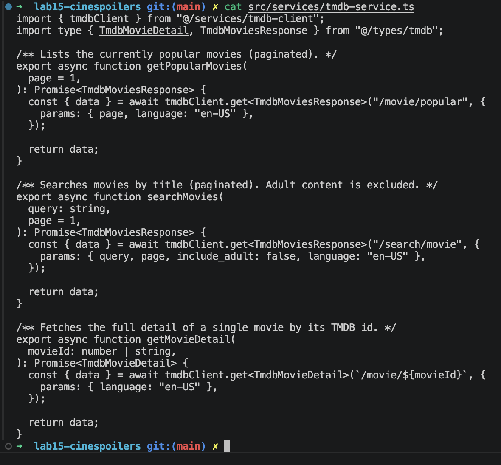
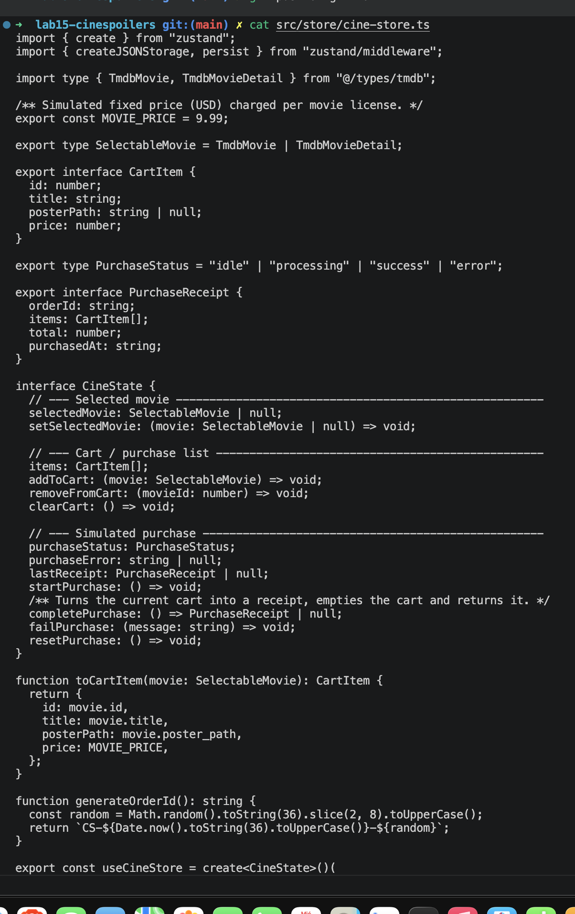
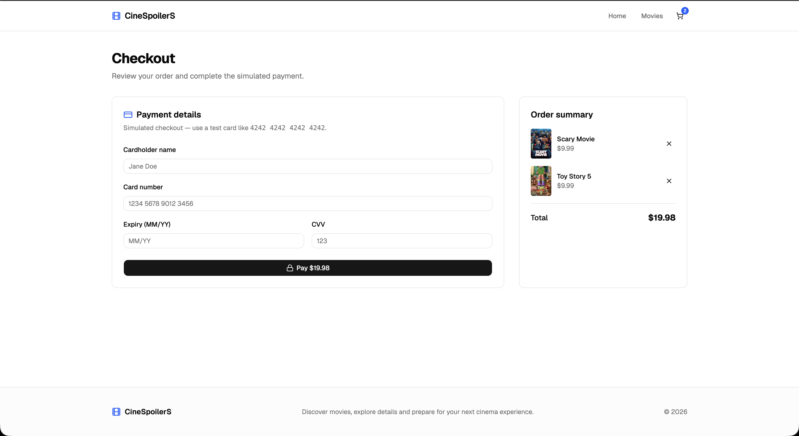

# CineSpoilers - Lab 15

## Evidencias del laboratorio

### a-b. Clonar y levantar el proyecto

- Repo clonado desde `elliotgaramendi/cinespoilers`
- `npm install` sin errores
- `npm run dev` levanta en `http://localhost:5174`

### c. Consumir data de TMDB

- Servicio creado: `src/services/tmdb-service.ts`, `src/services/tmdb-client.ts`
- Auth vía Bearer token (v4) en `VITE_TMDB_TOKEN`
- Integrado con TanStack Query
- Token probado contra TMDB → HTTP 200
- Compilación TS: sin errores | ESLint: sin errores nuevos

### d. Estado global (Zustand)

- Instalado `zustand@5.0.14`
- Archivo: `src/store/cine-store.ts`
- 3 dominios: película seleccionada, carrito de compra, compra simulada
- Carrito persistido en localStorage
- Compilación TS: sin errores | ESLint: limpio

### e. Pages desarrolladas

- Conectado a datos reales de TMDB (se eliminó el mock `src/data/movies.ts`)
- Home: populares por defecto, cambia a resultados de búsqueda con debounce
- Detalle: backdrop, póster, tagline, géneros, runtime, rating, overview
- Botón "Add to cart / In cart — remove" conectado al store de Zustand
- Estados de loading (skeletons), error (con retry) y "sin resultados" manejados
- Página 404 agregada para rutas no encontradas
- Build de producción: `npm run build` → 2013 módulos, exit 0
- TypeScript y ESLint: limpios

## f. Pasarela de pago (simulación)

- Página de checkout con resumen de orden (order summary) y formulario de pago simulado
- Carrito muestra items agregados desde el detalle, con precio fijo ($9.99 c/u) y total calculado
- Formulario: cardholder name, card number, expiry (MM/YY), CVV — con validación básica
- Sin integración a proveedor de pagos real (100% simulado)
- Botón "Pay $X.XX" dispara `startPurchase()` → `completePurchase()` del store de Zustand
- Opción de remover items del carrito antes de pagar (botón ×)